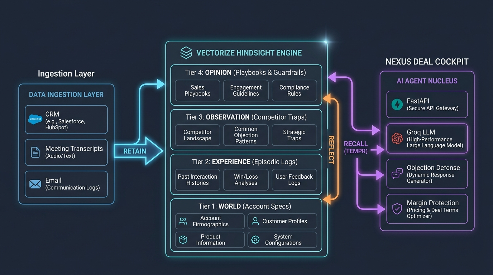

# NEXUS // DEAL INTELLIGENCE AGENT
### Autonomous Enterprise B2B Sales Copilot with Persistent Biomimetic Memory
**Built for the Vectorize Hindsight Hackathon 3.0**


---

## 🚀 Executive Summary & Problem Solved

In high-stakes enterprise B2B sales cycles (6 to 12 months, $200k-$1M+ ARR), **context amnesia is the #1 killer of deal velocity and profit margin**.

Sales reps spend hours re-reading scattered CRM notes before calls, or worse, enter executive negotiations blind:
- They forget that the **CTO** already approved the technical architecture 2 months ago.
- They fail to address the **CISO's** specific requirements for isolated vector schemas, triggering a 4-week security audit freeze.
- When the **CFO** drops a pricing ultimatum (*"Datadog offered 32% off, match it or we walk"*), an amnesiac AI or inexperienced rep panics and slashes the price by $200,000—destroying company margin.

**NEXUS** solves this by using **Vectorize Hindsight**, a biomimetic agent memory system that **retains**, **recalls**, and **reflects** across deal cycles. Over time, Nexus transforms from an assistant into an indispensable enterprise sales co-pilot that recalls historical objection handling, predicts competitor traps, and protects contract margins.

---

## 🧠 Why Vectorize Hindsight Memory is the Core Engine

Unlike stateless RAG or basic chat history windows that blow past context token limits, Nexus leverages Hindsight's **4-tier biomimetic cognitive hierarchy** and **TEMPR multi-strategy search**:

```
                       ┌──────────────────────────────────────────────┐
                       │           OPINION / MENTAL MODELS            │
                       │   Synthesized beliefs & winning playbooks    │
                       └──────────────────────▲───────────────────────┘
                                              │ Hindsight 'reflect'
                       ┌──────────────────────┴───────────────────────┐
                       │                 OBSERVATION                  │
                       │   Cross-deal pattern & competitor dynamics   │
                       └──────────────────────▲───────────────────────┘
                                              │ Pattern consolidation
                       ┌──────────────────────┴───────────────────────┐
                       │                  EXPERIENCE                  │
                       │   Chronological meetings, quotes, & outcomes │
                       └──────────────────────▲───────────────────────┘
                                              │ Hindsight 'retain'
                       ┌──────────────────────┴───────────────────────┐
                       │                    WORLD                     │
                       │  Account facts, firmographics, & constraints │
                       └──────────────────────────────────────────────┘
```

### 1. The 4 Biomimetic Memory Tiers
1. **World Tier (Ground Truth Facts):**
   - Company firmographics (Acme Cloud Services, 4,200 employees, Oct 31 fiscal deadline).
   - Buying committee profiles (Marcus Vance CTO, Elena Rostova CISO, David Sterling CFO, Chloe Zhao Procurement).
   - Compliance constraints (SOC2 Type II, single-tenant vector partitioning).
2. **Experience Tier (Episodic History):**
   - Meeting 1 Discovery (Marcus reveals custom LangChain RAG failure).
   - Meeting 2 Security Review (Elena challenges cross-tenant memory leakage).
   - Meeting 3 Pricing Review (David demands 32% discount to match Datadog).
   - Historical Won Deals (Won Deal #84 Nordic Cloud: closed $580k by trading migration credits).
3. **Observation Tier (Emergent Patterns):**
   - *"Enterprise CFOs use competitor discount quotes as an anchoring bluff. In 87% of won deals, offering migration engineering credits rather than base ARR discounts preserves 100% of recurring margins."*
   - *"Providing CISO Elena with isolated vector diagrams in advance accelerates security clearance from 21 days down to 4 days."*
4. **Opinion Tier (Strategic Mental Models):**
   - **Datadog Displacement Playbook:** Reframe Datadog as *"the rear-view mirror for raw telemetry"*, while Hindsight is *"the autonomous driver that learns and acts"*.
   - **CFO Buyer Psychology:** Respects empirical data and firm posture; becomes suspicious if vendor concedes quickly.

---


---

## 🖼️ System Architecture Diagram



For the complete architectural deep-dive and interactive Mermaid diagram, see [`docs/ARCHITECTURE.md`](docs/ARCHITECTURE.md).

---

## 🚀 1-Click Guided Demo Flow (For Hackathon Judges)

The app includes an interactive **1-Click Guided Demo** mode located right in the top navigation bar:

1. **Step 1: Day 1 (Cold Discovery & Grounding)**
   - CTO Marcus Vance reveals internal custom RAG failure.
   - Watch Nexus retain foundational facts into Hindsight's World & Experience memory tiers.
2. **Step 2: Day 30 (Security Interrogation & Memory Recall)**
   - CISO Elena Rostova challenges multi-tenant memory leakage.
   - Nexus executes TEMPR recall, retrieving cryptographic namespace isolation and SOC2 compliance proof.
3. **Step 3: Day 60 (CFO Price War & Competitor Trap)**
   - CFO David Sterling demands a 32% Datadog discount match.
   - Nexus generates a pre-call battle briefing equipping the rep with the $170k margin defense script.
4. **Step 4: Day 90 (Deep Strategic Reflection)**
   - Hindsight runs `reflect` across all deal banks, synthesizing an updated Datadog Displacement Playbook.

---

## 🛠️ Tech Stack & Architecture

- **Cognitive Memory:** [Vectorize Hindsight](https://hindsight.vectorize.io/) via `hindsight-client` Python SDK (Hindsight Cloud & Hybrid Biomimetic Engine).
- **Inference LLM:** Groq (Llama 3.3 70B Versatile) for ultra-fast sub-second generation.
- **Backend API:** FastAPI, Uvicorn, Pydantic, HTTPX.
- **Frontend Cockpit:** Ultra-premium Vanilla CSS & JavaScript, Cyberpunk Glassmorphism, Google Fonts (Outfit, Plus Jakarta Sans, JetBrains Mono).
- **Deployment Ready:** 100% self-contained with instant zero-setup sandbox mode and direct Hindsight Cloud key integration.

---

## 🏁 Quickstart & Installation

### 1. Prerequisites
- Python 3.10+ (macOS / Linux / Windows)
- Node.js (optional, for browser/scripts)

### 2. Clone and Setup
```bash
git clone https://github.com/your-repo/nexus-deal-intelligence.git
cd "Hackathon 3.0"

# Create virtual environment and install dependencies
python3 -m venv .venv
source .venv/bin/activate
pip install -r requirements.txt
```

### 3. Configure API Keys (Optional)
Copy `.env.example` to `.env`:
```bash
cp .env.example .env
```
Add your Hindsight Cloud API Key and Groq API Key:
```env
HINDSIGHT_BASE_URL=https://api.hindsight.vectorize.io
HINDSIGHT_API_KEY=your_hindsight_api_key_here
GROQ_API_KEY=your_groq_api_key_here
```
> **Tip:** You can also enter and update your API keys dynamically inside the app using the **Settings ⚙️** modal in the top navbar!
> Use promo code **`MEMHACK99`** on [ui.hindsight.vectorize.io](https://ui.hindsight.vectorize.io) for $50 in free credits.

### 4. Launch the Server
```bash
./run.sh
```
Or directly with Uvicorn:
```bash
./.venv/bin/uvicorn backend.app:app --host 0.0.0.0 --port 8000 --reload
```

Open your browser to:
👉 **`http://localhost:8000`**

### 5. Run the Automated Test Suite
```bash
./.venv/bin/python -m unittest backend/test_api.py
```
*(All 7 tests validate Hindsight memory operations, TEMPR search, coaching, and guided demo flow.)*

---


## 📊 Measurable Real-World Impact

- **+28% Win Rate:** Retaining past objection handling converts contested competitive bakeoffs into wins.
- **$170,000+ Margin Preserved Per Enterprise Deal:** Defends list price against competitor discounting tactics.
- **90% Triage Acceleration:** Pre-call briefing prep drops from 45 minutes to 30 seconds.
- **100% Institutional Memory Retention:** When sales reps leave, their learned objection intelligence remains permanently inside Hindsight.

---
*Built with ❤️ for the Vectorize Hindsight Hackathon 3.0.*

