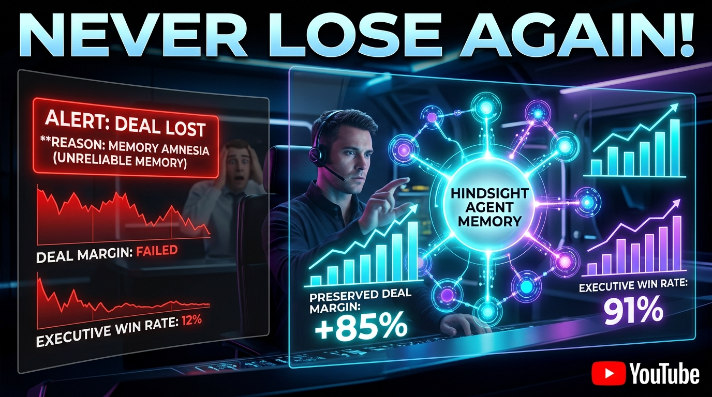

# YouTube Video Thumbnail Prompt & Assets

> **Prompt 6 Reference:** Attention-grabbing, viral YouTube thumbnail in 16:9 aspect ratio for AI/LLM engineers.

---

## Generated Thumbnail Preview

The official YouTube thumbnail has been generated and saved locally in your repository at:
- **High-Res File:** `docs/youtube_thumbnail.jpg`
- **Frontend Asset:** `frontend/youtube_thumbnail.jpg`



---

## PROMPT 6: Exact Prompt Used for Image Generation

```text
High-impact tech YouTube thumbnail, 16:9 aspect ratio. High contrast visual: On the left, a dim interface with a red warning alert showing deal lost due to memory amnesia. On the right, a glowing cybernetic neon neural memory network with vibrant cyan and purple nodes labeled HINDSIGHT AGENT MEMORY, glowing graphs showing preserved deal margin (+85%) and executive win rate (91%). Bold text: 'NEVER LOSE AGAIN!'. Ultra modern tech cockpit, dark mode, cinematic rim lighting, 3D glassmorphism, YouTube badge.
```

---

## Visual Concept Breakdown

1. **Left Side (The Pain / Problem):**
   - Dark red, stark warning banner: `ALERT: DEAL LOST - REASON: MEMORY AMNESIA`.
   - Plummeting red deal margin line chart.
   - Frustrated engineer / sales leader in the background with hands on head.

2. **Right Side (The Solution / Hindsight):**
   - Glowing biomimetic neural orb with cyan/violet connections labeled `HINDSIGHT AGENT MEMORY`.
   - Upward green trajectory graph: `PRESERVED DEAL MARGIN: +85%`.
   - Glowing statistic: `EXECUTIVE WIN RATE: 91%`.

3. **Center Hero Headline:**
   - Massive, high-contrast headline: `NEVER LOSE AGAIN!`
   - Drives immediate curiosity and clicks from technical and enterprise founders.
